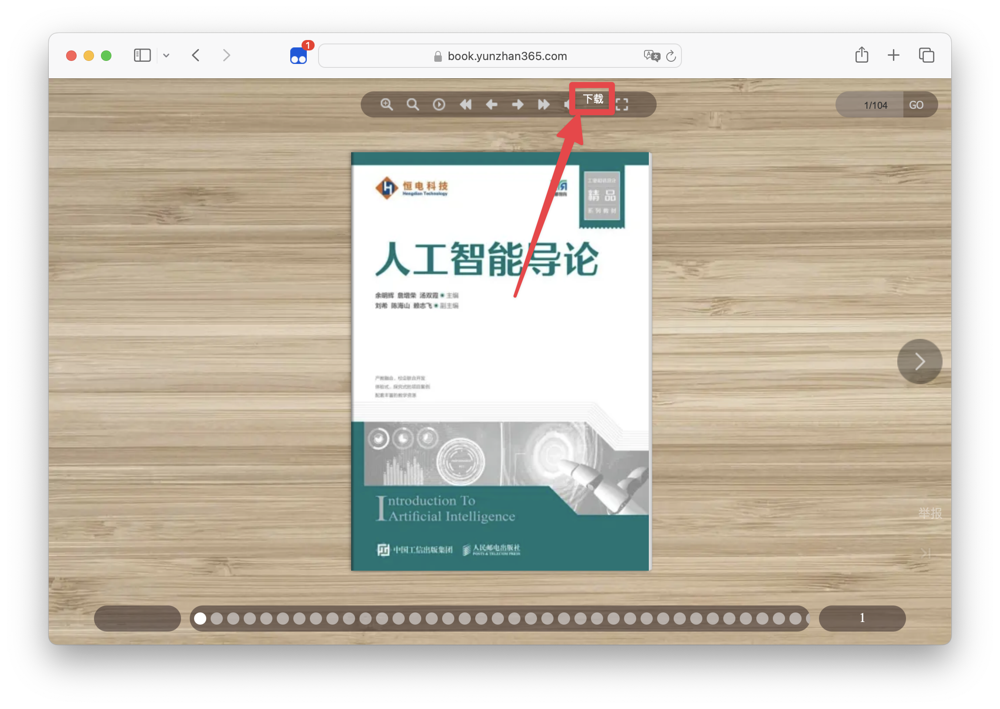
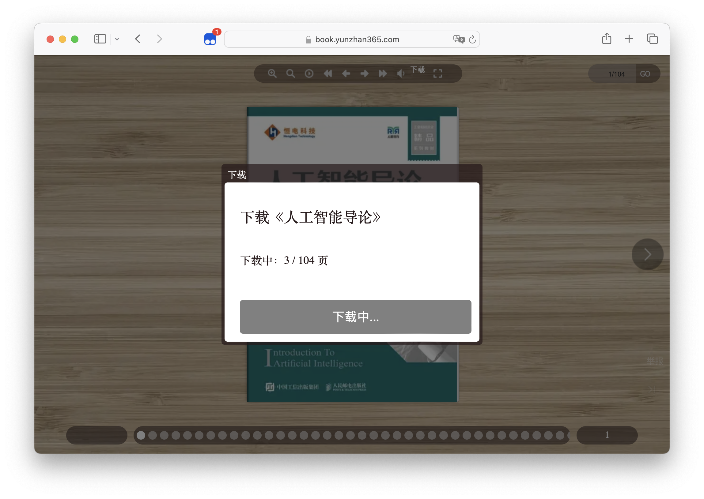

# DownLoad PDF book from YUNZHAN365
#### For Study and research use only

[GitHub](https://github.com/lcandy2/user.js/blob/main/yunzhan365.com/YunZhan-Downloader.md) | [GreasyFork](https://greasyfork.org/scripts/483545) | [ScriptCat](https://scriptcat.org/script-show-page/1462) | [OpenUserJS](https://openuserjs.org/scripts/Lcandy/%E4%BA%91%E5%B1%95%E7%BD%91PDF%E4%B8%8B%E8%BD%BD_YunZhanDownloader) | [Source Code](https://github.com/lcandy2/YunZhanDownloader)

### Features
The download button will appear in the upper right corner of the book page.

After clicking the download button, a dialog box will pop up to confirm the book information to be downloaded.

Waiting for the download to complete. When the download is complete, the save button will appear in the lower center of the page.

### Install UserScript Manager
- [Tampermonkey (Recommend)](https://www.tampermonkey.net/)
- others

### Install UserScript
- [GreasyFork (Recommend)](https://greasyfork.org/scripts/483545)
- [ScriptCat](https://scriptcat.org/script-show-page/1462)
- [GitHub](https://github.com/lcandy2/user.js/raw/main/yunzhan365.com/YunZhan-Downloader.user.js)
- [OpenUserJS](https://openuserjs.org/scripts/Lcandy/%E4%BA%91%E5%B1%95%E7%BD%91PDF%E4%B8%8B%E8%BD%BD_YunZhanDownloader.user.js)

### Usage
- Open the book page
- Click the `Download` button in the upper right corner
- Confirm the book information to be downloaded
- Click the `Download` button in the lower center
- Wait for the download to complete
- Enjoy it

### Support
- [x] PDF

### Thanks
- [@Kaoruha](https://github.com/Kaoruha)

### License
[MIT](./LICENSE)